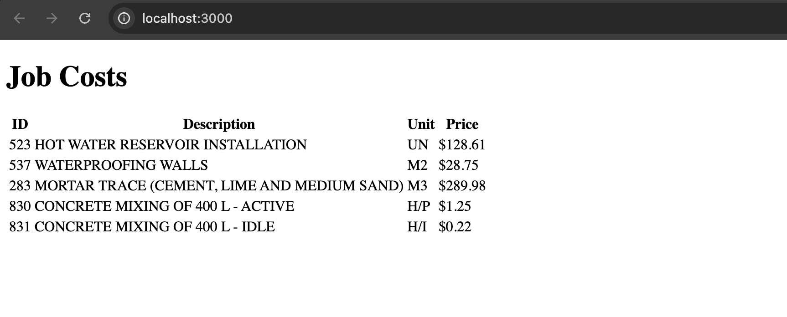

#Job Cost Calculation Application

### Overview
This application is designed to calculate the total cost of jobs in the construction industry based on provided job and item data. It utilizes TypeScript to ensure type safety and clarity throughout the codebase. The application reads job data from a JSON file, processes the information, and calculates costs based on job types and quantities.

### Features
Job Cost Calculation: The application calculates costs for jobs with both direct inputs and nested jobs.

Type Safety: Leveraging TypeScript interfaces, the application enforces structure and type safety

Data Handling: The job data is imported from a JSON file, allowing for easy updates and modifications to the input data without changing the core logic.

### Key Components
`JobData` Interface: Defines the structure of each job item, including properties such as 
jobId, jobDescription, jobUnit, jobType, itemId, itemDescription, itemUnit, jobItemQuantity, and pricePerUnit.

`Job` Interface: Represents the output structure for calculated jobs, including properties for code, job, unit, and totalCost.

Cost Calculation Functions:
`calculateInputCost(item: JobData)`: cost of individual job items based on quantity and unit price.
`calculateJobCost(jobId: number, calculatedJobs: Map<number, number>)`: calculates the total cost of a job:  for both direct inputs and nested jobs.
`calculateJobs()`: create a list of unique jobs with total costs.

### Installation
Install the necessary dependencies:
`npm install`
Usage
To run the application, use the following command:
`npm start`
To run tests for the application, use the following command:
`npm test`

### Testing
Tests are defined in the `calculateCost.test.ts `

